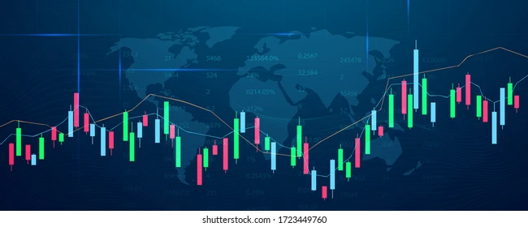

Welcome to "Algorithmic Trading System Development" documentation!
===================================

.. Welcome to "アルゴリズムトレード開発" documentation!

| このドキュメントはpythonを使った
| アルゴリズムトレードシステムの開発について書かれています

| This document for developing a algorithmic trading system by python.

..
.. It pulls data from the `Open Food Facts database <https://world.openfoodfacts.org/>`_
.. and offers a *simple* and *intuitive* API.

.. Check out the :doc:`usage` section for further information, including
.. how to :ref:`installation` the project.
..

.. note::
   このドキュメントはドラフトです。
   This project is under active development.

https://planset-study-sphinx.readthedocs.io/ja/latest/04.html

Contents
--------

.. toctree::
   table of contents
   first_step
   usage
   stock_price_analytics
   system_development
   system_development_2

