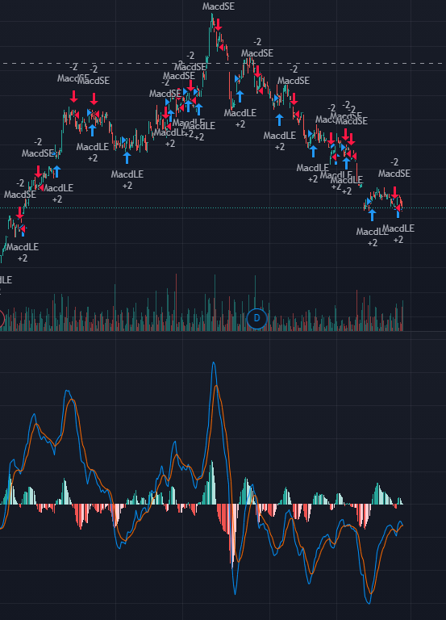

=======
system_development_2
=======

.. autosummary::
   :toctree: generated

   lumache

---

- アルゴリズム投資システムの作り方

- はじめに
・ ・システムにはさまざまな作り方があると思います。その中で１つの方法論として考えていただきたい ・自己責任でお願いします ・余裕資金で運用することが基本です

目次
1.システムトレードって何？
シストレの分類 ・トレードの頻度から 　デイトレ 　スイングトレード 　長期トレード ・機械的に 　シストレ・アルゴリズム 　AIトレード 　HFT

インフラ ・CPU i5 8世代以上 ・メモリ16G ・SSD 500GB以上 ・ネットワーク常時接続 10Mbps以上

ソフトウェア ・kabu station API ・hyper sbi

2．システムトレードのサブシステム
2-1.データ取得・蓄積 2-2.スクリーンニング 2-3.トレードシステム ・トレードシステムとストラテジを分離する 　・ストラテジの作成 　　・スクリーンニングとの連携 ・トレードシステム ・メインロジックとスレッド 　 　　・ストラテジを読み込む 　 　・スレッドとループ構造

　・売買プログラム 　　・データ監視とシグナル検出のアルゴリズム 　 ・アルゴリズムをロジックに埋め込む 　・個々のフラグ・フィルタを多用する手法 　・フラグの完成がシグナル発生

　・実 trade プログラム 　　・trade-start 　　・trade-end

※注意点 　　・完全性が求められる。 　　・1行、1文字たりとも不明点をつくらない 　・何が起きても安全なように（failsafe) 　　・メールでのアラート 　　・何かあったときにいつでも手動で対応できる体制

　　・実際にお金が発生するので注意 ・最初は少額から ・何が起きても対応できるように。

2-4.画面・表示系（UI/UX） 　　・株価監視 　・スクリーンニング インタフェース 　・ログ インタフェース 　・ストラテジ　インタフェース

2-5.バックテスト 　　・アルゴリズムを試す 　・バックテストを利用した開発 ・サンプルアルゴリズムの利益率

　　・トレードタイムラインを作る

全体のシステムフロー

3.pythonで作るトレード
　なぜpythonを選ぶのか？ ・データ系のライブラリが豊富 ・高速処理を必要としない

3-1.jupyter notebook ・・・

2-1.データ取得・蓄積・表示
・取得元：yahoo , trading view , twelve data ,,, ●データベースにデータを保存する ・sqlite , sql ・テーブル定義 ・select ●データをプロットする ・bokeh ・他のライブラリ

2-2.スクリーンニング
スクリーンニングとは？

・市販のスクリーンニングツールと、自作のメリット

●スクリーンニングプログラム概要

・簡単なスクリーンニング 　・シグナルを作る 　　・macdのデッドクロス 　　・macdのゴールデンクロス

・高度なスクリーンニング 　　・macdのデッドクロス

●スクリーンニングの作り方 1.データの読み込み 2.

